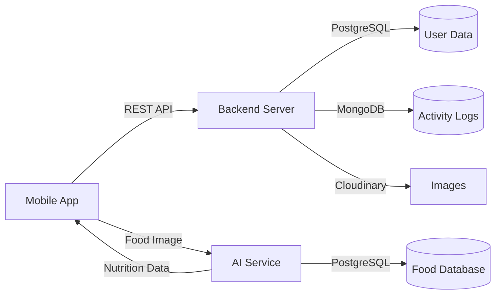

<div align="center">

# 🏋️ ICoach

### Your AI-Powered Personal Fitness & Nutrition Assistant

[](https://www.typescriptlang.org/)
[](https://reactnative.dev/)
[](https://nodejs.org/)
[](https://www.python.org/)
[](https://www.postgresql.org/)
[](https://www.mongodb.com/)
[](https://www.docker.com/)

**A comprehensive fitness and nutrition platform combining mobile app, backend services, and AI-powered food recognition**

[Features](#-key-features) • [Architecture](#-architecture) • [Quick Start](#-quick-start) • [Documentation](#-documentation) • [Tech Stack](#-technology-stack)

</div>

---

## 📖 Overview

**ICoach** is a full-stack health and fitness application that empowers users to track their workouts, monitor nutrition, and achieve their fitness goals with the help of AI. The platform combines a mobile application built with React Native, a robust Node.js backend with multi-database support, and an AI service for intelligent food recognition.

### 🎯 What Makes ICoach Special?

- **🤖 AI-Powered Food Recognition** - Snap a photo of your meal and instantly get nutritional information
- **💪 Comprehensive Workout Library** - Access hundreds of exercises with detailed instructions and GIFs
- **📊 Smart Nutrition Tracking** - Monitor macros, calories, and nutritional goals effortlessly
- **🌍 Multi-language Support** - Available in English, Arabic, French, German, Spanish, and Icelandic
- **🔐 Secure Authentication** - OAuth integration with Google, Facebook, and GitHub
- **📱 Cross-Platform** - iOS, Android, and Web support through React Native

---

## ✨ Key Features

### 📱 Mobile Application
- **Modern UI/UX** - Clean, intuitive interface with smooth animations
- **Authentication Flow** - Sign up, sign in, OAuth providers
- **Profile Management** - Track body metrics, goals, and progress
- **Workout Tracking** - Browse exercises, create routines, log workouts
- **Nutrition Dashboard** - Daily calorie intake, macro tracking
- **Multi-language** - i18n support with 6 languages
- **Offline Support** - AsyncStorage for data persistence

### 🖥️ Backend Server
- **RESTful API** - Comprehensive endpoints for all features
- **Dual Database** - PostgreSQL for relational data, MongoDB for flexible schemas
- **Authentication & Authorization** - JWT tokens, OAuth 2.0, session management
- **Image Management** - Cloudinary integration for media storage
- **Email Service** - Nodemailer for notifications and verification
- **API Documentation** - Interactive Swagger/OpenAPI docs
- **Database Migrations** - Sequelize migrations and seeders
- **Docker Support** - Containerized deployment ready

### 🤖 AI Service
- **Food Recognition** - EfficientNetB0 model trained on 100+ food classes
- **Nutrition Analysis** - Automatic nutritional breakdown from images
- **FastAPI Backend** - High-performance Python API
- **Arabic Cuisine Support** - Specialized recognition for Middle Eastern dishes
- **Confidence Scoring** - Reliable predictions with accuracy metrics
- **Docker Deployment** - Containerized ML model serving

---

## 🏗️ Architecture

```
Icoach-app/
│
├── 📱 application/          # React Native Mobile App
│   ├── src/
│   │   ├── components/     # Reusable UI components
│   │   ├── screens/        # App screens (Auth, Profile, Foods, etc.)
│   │   ├── navigation/     # React Navigation setup
│   │   ├── services/       # API integration layer
│   │   ├── context/        # Global state management
│   │   ├── hooks/          # Custom React hooks
│   │   ├── utils/          # Helper functions & validators
│   │   ├── constants/      # Theme, colors, sizes
│   │   └── types/          # TypeScript definitions
│   └── i18n/               # Internationalization
│
├── 🖥️ server/              # Node.js + TypeScript Backend
│   ├── src/
│   │   ├── controllers/    # Request handlers
│   │   ├── routes/         # API endpoints
│   │   ├── models/         # Database models (Sequelize & Mongoose)
│   │   ├── services/       # Business logic
│   │   ├── middleware/     # Auth, validation, error handling
│   │   ├── config/         # Database & app configuration
│   │   ├── migrations/     # Database migrations
│   │   └── seeders/        # Database seeders
│   ├── data/               # Seed data (workouts, foods)
│   └── public/             # Static assets
│
├── 🤖 AI/                  # Python AI Service
│   ├── AI_API_Features/
│   │   ├── routers/        # FastAPI routes
│   │   ├── services/       # ML model integration
│   │   ├── models/         # Database models
│   │   └── config/         # Database & settings
│   ├── food_predict_feature/
│   │   ├── best_model_food100.keras  # Trained model
│   │   └── class_names.json          # Food categories
│   └── main.py             # FastAPI application
│
└── 🌐 frontend/            # Web Frontend (Future)
```

### 🔄 Data Flow



---

## 🚀 Quick Start

### Prerequisites

Before you begin, ensure you have the following installed:

- **Node.js** (v16 or higher)
- **npm** or **yarn**
- **Python** (v3.8 or higher)
- **PostgreSQL** (v13 or higher)
- **MongoDB** (v5 or higher)
- **Docker** & **Docker Compose** (optional, for containerized deployment)
- **Expo CLI** (for mobile development)

### 🎯 Option 1: Manual Setup

#### 1️⃣ Clone the Repository

```bash
git clone https://github.com/youssef-m-roushdy/Icoach-app.git
cd Icoach-app
```

#### 2️⃣ Setup Backend Server

```bash
cd server

# Install dependencies
npm install

# Create environment file
cp .env.example .env
# Edit .env with your database credentials and API keys

# Run migrations
npx sequelize-cli db:migrate

# Seed database with initial data
npx sequelize-cli db:seed:all

# Start development server
npm run dev
```

Server will be running at `http://localhost:3000`

**API Documentation:** `http://localhost:3000/api-docs`

#### 3️⃣ Setup AI Service

```bash
cd ../AI

# Create virtual environment
python -m venv venv
source venv/bin/activate  # On Windows: venv\Scripts\activate

# Install dependencies
pip install -r requirements-api.txt

# Create environment file
cp .env.example .env
# Edit .env with your database credentials

# Start FastAPI server
uvicorn main:app --reload --host 0.0.0.0 --port 8000
```

AI Service will be running at `http://localhost:8000`

**API Documentation:** `http://localhost:8000/docs`

#### 4️⃣ Setup Mobile Application

```bash
cd ../application

# Install dependencies
npm install

# Create environment file
cp .env.example .env
# Edit .env with your API endpoints

# Start Expo development server
npm start
```

Scan the QR code with **Expo Go** app (iOS/Android) or press `w` for web.

### 🐳 Option 2: Docker Setup

#### Backend + Database

```bash
cd server
docker-compose up --build
```

#### AI Service + Database

```bash
cd AI
docker-compose up --build
```

---

## 📚 Documentation

Detailed documentation for each component:

### 📱 Mobile Application
- [Quick Start Guide](./application/QUICKSTART.md)
- [Architecture & Structure](./application/STRUCTURE.md)
- [Migration Summary](./application/MIGRATION_SUMMARY.md)

### 🖥️ Backend Server
- [API Documentation](./server/README.md)
- [Database Setup](./server/README.Docker.md)
- [Workout API Guide](./server/WORKOUT_API.md)
- [PgAdmin Guide](./server/PGADMIN_GUIDE.md)

### 🤖 AI Service
- [Setup Guide](./AI/README.md)
- [Docker Guide](./AI/DOCKER_GUIDE.md)
- [Quick Start](./AI/QUICKSTART.md)

---

## 🛠️ Technology Stack

### Mobile Application
| Technology | Purpose |
|------------|---------|
| **React Native** | Cross-platform mobile framework |
| **TypeScript** | Type-safe development |
| **Expo** | Development toolchain |
| **React Navigation** | Navigation & routing |
| **i18next** | Internationalization |
| **AsyncStorage** | Local data persistence |
| **React Context API** | State management |

### Backend Server
| Technology | Purpose |
|------------|---------|
| **Node.js** | JavaScript runtime |
| **Express** | Web framework |
| **TypeScript** | Type safety |
| **PostgreSQL** | Primary database |
| **MongoDB** | Document storage |
| **Sequelize** | PostgreSQL ORM |
| **Mongoose** | MongoDB ODM |
| **Passport.js** | Authentication |
| **JWT** | Token-based auth |
| **Cloudinary** | Image hosting |
| **Nodemailer** | Email service |
| **Swagger** | API documentation |

### AI Service
| Technology | Purpose |
|------------|---------|
| **Python** | Programming language |
| **FastAPI** | Modern web framework |
| **TensorFlow/Keras** | Deep learning |
| **EfficientNetB0** | CNN architecture |
| **PostgreSQL** | Nutrition database |
| **Uvicorn** | ASGI server |
| **Pydantic** | Data validation |

---

## 📊 Database Schema

### PostgreSQL Tables

#### Users & Authentication
- `users` - User accounts and profiles
- `sessions` - Active user sessions

#### Fitness Data
- `workouts` - Exercise library (270+ exercises)
- `user_workouts` - User workout history
- `body_metrics` - Height, weight, BMI tracking

#### Nutrition Data
- `foods` - Food nutrition database (100+ items)
- `user_meals` - Meal tracking
- `daily_nutrition` - Daily calorie/macro logs

### MongoDB Collections
- `activity_logs` - User activity tracking
- `notifications` - Push notifications
- `analytics` - Usage analytics

---

## 🔐 Authentication & Security

- **JWT Tokens** - Secure, stateless authentication
- **OAuth 2.0** - Google, Facebook, GitHub integration
- **Password Hashing** - bcrypt encryption
- **HTTPS Only** - Secure data transmission
- **CORS Protection** - Configured origins
- **Rate Limiting** - DDoS protection
- **Input Validation** - SQL injection prevention
- **Session Management** - Secure cookie handling

---

## 🌍 Internationalization

Supported languages:
- 🇬🇧 English
- 🇸🇦 Arabic (العربية)
- 🇫🇷 French (Français)
- 🇩🇪 German (Deutsch)
- 🇪🇸 Spanish (Español)
- 🇮🇸 Icelandic (Íslenska)

---

## 📱 Supported Platforms

| Platform | Status |
|----------|--------|
| iOS | ✅ Supported |
| Android | ✅ Supported |
| Web | ✅ Supported |
| Windows | 🔄 Planned |
| macOS | 🔄 Planned |

---

## 🚧 Development Workflow

### Running Tests
```bash
# Backend tests
cd server
npm test

# AI service tests
cd AI
pytest
```

### Database Operations
```bash
# Create new migration
npx sequelize-cli migration:generate --name migration-name

# Run migrations
npx sequelize-cli db:migrate

# Undo last migration
npx sequelize-cli db:migrate:undo

# Create seeder
npx sequelize-cli seed:generate --name seeder-name

# Run seeders
npx sequelize-cli db:seed:all
```

### Building for Production

#### Mobile App
```bash
cd application

# Android
npm run build:android

# iOS
npm run build:ios
```

#### Backend
```bash
cd server
npm run build
npm start
```

#### AI Service
```bash
cd AI
docker build -t icoach-ai:latest .
docker run -p 8000:8000 icoach-ai:latest
```

---

## 📈 Features Roadmap

### In Progress 🔄
- [ ] Real-time workout tracking
- [ ] Social features (friends, challenges)
- [ ] Progress photos and comparisons
- [ ] Custom meal plans
- [ ] Advanced analytics dashboard

### Planned 📝
- [ ] Wearable device integration
- [ ] AI-powered workout recommendations
- [ ] Video exercise demonstrations
- [ ] Nutrition planning assistant
- [ ] Community forums
- [ ] Premium subscription tiers
- [ ] Coach/Trainer accounts
- [ ] Barcode scanner for foods

---

## 🤝 Contributing

Contributions are welcome! Please follow these steps:

1. Fork the repository
2. Create a feature branch (`git checkout -b feature/AmazingFeature`)
3. Commit your changes (`git commit -m 'Add some AmazingFeature'`)
4. Push to the branch (`git push origin feature/AmazingFeature`)
5. Open a Pull Request

### Coding Standards
- Follow TypeScript best practices
- Write meaningful commit messages
- Add tests for new features
- Update documentation as needed
- Follow existing code style

---

## 📝 License

This project is licensed under the ISC License - see the [LICENSE](LICENSE) file for details.

---

## 👨‍💻 Authors

**Youssef M. Roushdy**
- GitHub: [@youssef-m-roushdy](https://github.com/youssef-m-roushdy)

---

## 🙏 Acknowledgments

- **TensorFlow Team** - For the amazing ML framework
- **Expo Team** - For simplifying React Native development
- **OpenAI** - For AI assistance in development
- **Cloudinary** - For image hosting services
- **Community Contributors** - For valuable feedback and contributions

---

## 📞 Support

For support, email support@icoach.app or join our Slack channel.

---

<div align="center">

### ⭐ Star this repo if you find it helpful!

**Made with ❤️ and lots of ☕**

[Report Bug](https://github.com/youssef-m-roushdy/Icoach-app/issues) • [Request Feature](https://github.com/youssef-m-roushdy/Icoach-app/issues)

</div>
