<div align="center">

# 🏋️ ICoach

> **ICoach** is a comprehensive AI-powered fitness and nutrition platform designed to help users achieve their health goals through intelligent workout tracking, food recognition, and personalized guidance.


### Your AI-Powered Personal Fitness & Nutrition Assistant

[](https://www.typescriptlang.org/)
[](https://reactnative.dev/)
[](https://nodejs.org/)
[](https://www.python.org/)
[](https://www.postgresql.org/)
[](https://www.mongodb.com/)
[](https://www.docker.com/)

**A comprehensive fitness and nutrition platform combining mobile app, backend services, and AI-powered food recognition**

[Features](#-key-features) • [Architecture](#-architecture) • [Quick Start](#-quick-start) • [Documentation](#-documentation) • [Tech Stack](#-technology-stack)

</div>

---

## 📖 Overview

**ICoach** is a full-stack health and fitness application that empowers users to track their workouts, monitor nutrition, and achieve their fitness goals with the help of AI. The platform combines a mobile application built with React Native, a robust Node.js backend with multi-database support, and an AI service for intelligent food recognition.

### 🎯 What Makes ICoach Special?

- **🤖 AI-Powered Food Recognition** - Snap a photo of your meal and instantly get nutritional information
- **💪 Comprehensive Workout Library** - Access hundreds of exercises with detailed instructions and GIFs
- **📊 Smart Nutrition Tracking** - Monitor macros, calories, and nutritional goals effortlessly
- **🌍 Multi-language Support** - Available in English, Arabic, French, German, Spanish, and Icelandic
- **🔐 Secure Authentication** - OAuth integration with Google, Facebook, and GitHub
- **📱 Cross-Platform** - iOS, Android, and Web support through React Native

---

## ✨ Key Features

### 📱 Mobile Application
- **Modern UI/UX** - Clean, intuitive interface with smooth animations
- **Authentication Flow** - Sign up, sign in, Google OAuth, password reset
- **Automatic Token Refresh** - Seamless re-authentication when tokens expire
- **Profile Management** - Track body metrics (height, weight, BMI), goals, and progress
- **Body Info Editor** - Update fitness goals, activity level, body measurements
- **Workout Library** - Browse 270+ exercises with GIF demonstrations
- **Save Workouts** - Bookmark favorite exercises for quick access
- **Food Recognition** - AI-powered meal analysis with camera/gallery picker
- **Nutrition Tracking** - Daily calorie intake, macro tracking
- **Multi-language** - i18n support with 6 languages
- **Offline Support** - AsyncStorage for data persistence
- **Deep Linking** - OAuth callback handling

### 🖥️ Backend Server
- **RESTful API** - Comprehensive endpoints for all features (v1 versioned)
- **Dual Database** - PostgreSQL for relational data, MongoDB for flexible schemas
- **JWT Authentication** - Access tokens (15min) + Refresh tokens (7 days)
- **Token Refresh Endpoint** - Automatic token renewal support
- **OAuth 2.0** - Google Sign-In with mobile ID token verification
- **User Management** - Registration, login, profile CRUD, body metrics
- **Workout API** - Full CRUD with filtering by body part, equipment, level
- **Saved Workouts** - User favorites and bookmarks management
- **Food API** - Nutrition data with search and filtering
- **Image Management** - Cloudinary integration for avatars and media
- **Email Service** - Nodemailer for verification and notifications
- **API Documentation** - Interactive Swagger/OpenAPI docs
- **Database Migrations** - Sequelize migrations and seeders
- **Docker Support** - Containerized deployment with docker-compose
- **Error Handling** - Centralized error handling with custom error classes

### 🤖 AI Service
- **Food Recognition** - EfficientNetB0 model trained on 100+ food classes
- **Nutrition Analysis** - Automatic nutritional breakdown from images
- **FastAPI Backend** - High-performance Python API
- **Arabic Cuisine Support** - Specialized recognition for Middle Eastern dishes
- **Confidence Scoring** - Reliable predictions with accuracy metrics
- **Docker Deployment** - Containerized ML model serving

---

## 🏗️ Architecture

```
Icoach-app/
│
├── 📱 application/          # React Native Mobile App (Expo)
│   ├── src/
│   │   ├── components/     # Reusable UI components
│   │   │   ├── common/     # Buttons, Inputs, GoogleButton, etc.
│   │   │   └── auth/       # Auth-specific components
│   │   ├── screens/        # App screens
│   │   │   ├── WelcomeScreen.tsx
│   │   │   ├── SignInScreen.tsx
│   │   │   ├── SignupScreen.tsx
│   │   │   ├── HomeScreen.tsx
│   │   │   ├── ProfileScreen.tsx
│   │   │   ├── EditProfileScreen.tsx
│   │   │   ├── EditBodyInfoScreen.tsx
│   │   │   ├── WorkoutsScreen.tsx
│   │   │   ├── FoodsScreen.tsx
│   │   │   ├── MessagesScreen.tsx
│   │   │   ├── OnboardingScreen.tsx
│   │   │   └── AuthCallbackScreen.tsx
│   │   ├── navigation/     # React Navigation setup
│   │   ├── services/       # API integration (api.ts)
│   │   ├── context/        # AuthContext with token management
│   │   ├── hooks/          # Custom React hooks
│   │   ├── utils/          # Helper functions & validators
│   │   ├── constants/      # Theme, colors, sizes
│   │   └── types/          # TypeScript definitions
│   ├── i18n/               # Internationalization (6 languages)
│   └── assets/             # Fonts, images
│
├── 🖥️ server/              # Node.js + Express + TypeScript Backend
│   ├── src/
│   │   ├── controllers/    # Request handlers
│   │   │   ├── authController.ts
│   │   │   ├── userController.ts
│   │   │   ├── workoutController.ts
│   │   │   ├── foodController.ts
│   │   │   └── savedWorkoutController.ts
│   │   ├── routes/v1/      # API endpoints (versioned)
│   │   │   ├── authRoutes.ts
│   │   │   ├── userRoutes.ts
│   │   │   ├── workoutRoutes.ts
│   │   │   ├── foodRoutes.ts
│   │   │   └── savedWorkoutRoutes.ts
│   │   ├── models/         # Database models
│   │   │   ├── sql/        # Sequelize models (User, Workout, Food)
│   │   │   └── nosql/      # Mongoose models
│   │   ├── services/       # Business logic
│   │   │   ├── userService.ts
│   │   │   ├── emailService.ts
│   │   │   └── imageService.ts
│   │   ├── middleware/     # Auth, validation, error handling
│   │   ├── config/         # Database & JWT configuration
│   │   ├── migrations/     # Database migrations
│   │   └── seeders/        # Database seeders
│   ├── data/               # Seed data (workouts CSV, foods JSON)
│   └── uploads/            # Local file uploads
│
├── 🤖 AI/                  # Python AI Service (FastAPI)
│   ├── AI_API_Features/
│   │   ├── routers/        # FastAPI routes (food.py)
│   │   ├── services/       # ML & DB services
│   │   ├── models/         # Pydantic schemas
│   │   └── config/         # Database & settings
│   ├── food_predict_feature/
│   │   ├── best_model_food100.keras  # Trained EfficientNetB0 model
│   │   └── class_names.json          # 100+ food categories
│   └── main.py             # FastAPI application entry
│
└── 🌐 frontend/            # Web Frontend (Planned)
```

### 🔄 Data Flow

```mermaid
graph TB
    %% User Layer
    User([👤 User])
    
    %% Mobile App Modules
    subgraph "📱 Mobile App (React Native)"
        UI[User Interface]
        AuthModule[Authentication<br/>- Login/Signup<br/>- OAuth<br/>- Token Refresh]
        WorkoutModule[Workout Tracking<br/>- Exercise Library<br/>- Progress Tracking]
        NutritionModule[Nutrition<br/>- Food Logging<br/>- Camera/Gallery]
        ProfileModule[Profile Management<br/>- Body Metrics<br/>- Goals]
        Storage[Local Storage<br/>- AsyncStorage<br/>- Offline Data]
    end
    
    %% Backend Services
    subgraph "🖥️ Backend (Node.js/Express)"
        API[API Gateway<br/>RESTful Endpoints]
        
        subgraph "🔐 Authentication Service"
            AuthDB[(PostgreSQL<br/>Users & Tokens)]
            JWT[JWT Manager]
            OAuth[OAuth Handler<br/>Google/Facebook/GitHub]
        end
        
        subgraph "💪 Workout Service"
            WorkoutDB[(PostgreSQL<br/>Exercises & Workouts)]
            WorkoutLogic[Workout Logic]
        end
        
        subgraph "🥗 Nutrition Service"
            NutritionDB[(MongoDB<br/>Food & Nutrition)]
            NutritionLogic[Nutrition Logic]
        end
        
        subgraph "📊 User Service"
            UserDB[(PostgreSQL<br/>Profiles & Metrics)]
            UserLogic[User Logic]
        end
        
        ImageService[Image Service<br/>Cloudinary]
        EmailService[Email Service<br/>Nodemailer]
    end
    
    %% AI Service
    subgraph "🤖 AI Service (Python/FastAPI)"
        AI_API[AI API]
        FoodRecognition[Food Recognition Model<br/>EfficientNetB0]
        NutritionAnalysis[Nutrition Analysis]
    end
    
    %% External Services
    Cloudinary[Cloudinary<br/>Image Storage]
    OAuthProviders[OAuth Providers<br/>Google/Facebook/GitHub]
    
    %% Data Flow Connections
    
    %% User to Mobile App
    User --> UI
    
    %% Mobile App Internal Flow
    UI --> AuthModule
    UI --> WorkoutModule
    UI --> NutritionModule
    UI --> ProfileModule
    AuthModule --> Storage
    WorkoutModule --> Storage
    NutritionModule --> Storage
    ProfileModule --> Storage
    
    %% Mobile App to Backend
    AuthModule --> API
    WorkoutModule --> API
    NutritionModule --> API
    ProfileModule --> API
    
    %% Backend Internal Flow
    API --> AuthService
    API --> WorkoutService
    API --> NutritionService
    API --> UserService
    API --> ImageService
    API --> EmailService
    
    AuthService --> JWT
    AuthService --> OAuth
    JWT --> AuthDB
    OAuth --> OAuthProviders
    
    WorkoutService --> WorkoutLogic
    WorkoutLogic --> WorkoutDB
    
    NutritionService --> NutritionLogic
    NutritionLogic --> NutritionDB
    
    UserService --> UserLogic
    UserLogic --> UserDB
    
    ImageService --> Cloudinary
    
    %% Backend to AI Service
    NutritionService --> AI_API
    
    %% AI Service Internal
    AI_API --> FoodRecognition
    FoodRecognition --> NutritionAnalysis
    
    %% Styling
    classDef mobile fill:#e1f5fe,stroke:#0277bd,stroke-width:2px
    classDef backend fill:#f3e5f5,stroke:#7b1fa2,stroke-width:2px
    classDef ai fill:#e8f5e8,stroke:#2e7d32,stroke-width:2px
    classDef external fill:#fff3e0,stroke:#ef6c00,stroke-width:2px
    classDef user fill:#fce4ec,stroke:#c2185b,stroke-width:2px
    classDef db fill:#e0f2f1,stroke:#00695c,stroke-width:2px
    
    class UI,AuthModule,WorkoutModule,NutritionModule,ProfileModule,Storage mobile
    class API,AuthService,WorkoutService,NutritionService,UserService,ImageService,EmailService,JWT,OAuth,WorkoutLogic,NutritionLogic,UserLogic backend
    class AI_API,FoodRecognition,NutritionAnalysis ai
    class Cloudinary,OAuthProviders external
    class User user
    class AuthDB,WorkoutDB,NutritionDB,UserDB db
```



### 🔄 Authentication Flow (Simplified)


---

## 🚀 Quick Start

### Prerequisites

Before you begin, ensure you have the following installed:

- **Node.js** (v16 or higher)
- **npm** or **yarn**
- **Python** (v3.8 or higher)
- **PostgreSQL** (v13 or higher)
- **MongoDB** (v5 or higher)
- **Docker** & **Docker Compose** (optional, for containerized deployment)
- **Expo CLI** (for mobile development)

### 🎯 Option 1: Manual Setup

#### 1️⃣ Clone the Repository

```bash
git clone https://github.com/youssef-m-roushdy/Icoach-app.git
cd Icoach-app
```

#### 2️⃣ Setup Backend Server

```bash
cd server

# Install dependencies
npm install

# Create environment file
cp .env.example .env
# Edit .env with your database credentials and API keys

# Run migrations
npx sequelize-cli db:migrate

# Seed database with initial data
npx sequelize-cli db:seed:all

# Start development server
npm run dev
```

Server will be running at `http://localhost:3000`

**API Documentation:** `http://localhost:3000/api-docs`

#### 3️⃣ Setup AI Service

```bash
cd ../AI

# Create virtual environment
python -m venv venv
source venv/bin/activate  # On Windows: venv\Scripts\activate

# Install dependencies
pip install -r requirements-api.txt

# Create environment file
cp .env.example .env
# Edit .env with your database credentials

# Start FastAPI server
uvicorn main:app --reload --host 0.0.0.0 --port 8000
```

AI Service will be running at `http://localhost:8000`

**API Documentation:** `http://localhost:8000/docs`

#### 4️⃣ Setup Mobile Application

```bash
cd ../application

# Install dependencies
npm install

# Create environment file
cp .env.example .env
# Edit .env with your API endpoints

# Start Expo development server
npm start
```

Scan the QR code with **Expo Go** app (iOS/Android) or press `w` for web.

### 🐳 Option 2: Docker Setup

#### Backend + Database

```bash
cd server
docker-compose up --build
```

#### AI Service + Database

```bash
cd AI
docker-compose up --build
```

---

## 📚 Documentation

Detailed documentation for each component:

### 📱 Mobile Application
- [Quick Start Guide](./application/QUICKSTART.md)
- [Architecture & Structure](./application/STRUCTURE.md)
- [Migration Summary](./application/MIGRATION_SUMMARY.md)

### 🖥️ Backend Server
- [API Documentation](./server/README.md)
- [Database Setup](./server/README.Docker.md)
- [Workout API Guide](./server/WORKOUT_API.md)
- [PgAdmin Guide](./server/PGADMIN_GUIDE.md)

### 🤖 AI Service
- [Setup Guide](./AI/README.md)
- [Docker Guide](./AI/DOCKER_GUIDE.md)
- [Quick Start](./AI/QUICKSTART.md)

---

## 🛠️ Technology Stack

### Mobile Application
| Technology | Purpose |
|------------|---------|
| **React Native** | Cross-platform mobile framework |
| **TypeScript** | Type-safe development |
| **Expo** | Development toolchain |
| **React Navigation** | Navigation & routing |
| **i18next** | Internationalization |
| **AsyncStorage** | Local data persistence |
| **React Context API** | State management |

### Backend Server
| Technology | Purpose |
|------------|---------|
| **Node.js** | JavaScript runtime |
| **Express** | Web framework |
| **TypeScript** | Type safety |
| **PostgreSQL** | Primary database |
| **MongoDB** | Document storage |
| **Sequelize** | PostgreSQL ORM |
| **Mongoose** | MongoDB ODM |
| **Passport.js** | Authentication |
| **JWT** | Token-based auth |
| **Cloudinary** | Image hosting |
| **Nodemailer** | Email service |
| **Swagger** | API documentation |

### AI Service
| Technology | Purpose |
|------------|---------|
| **Python** | Programming language |
| **FastAPI** | Modern web framework |
| **TensorFlow/Keras** | Deep learning |
| **EfficientNetB0** | CNN architecture |
| **PostgreSQL** | Nutrition database |
| **Uvicorn** | ASGI server |
| **Pydantic** | Data validation |

---

## � API Endpoints Overview

### Authentication (`/api/v1/auth`)
| Method | Endpoint | Description |
|--------|----------|-------------|
| GET | `/google` | Initiate Google OAuth flow (web) |
| GET | `/google/callback` | Google OAuth callback |
| POST | `/google/mobile` | Google Sign-In for mobile apps |

### Users (`/api/v1/users`)
| Method | Endpoint | Description |
|--------|----------|-------------|
| POST | `/register` | Register new user (returns tokens) |
| POST | `/login` | Login user |
| POST | `/logout` | Logout user |
| POST | `/refresh-token` | Refresh access token |
| GET | `/profile` | Get current user profile |
| PUT | `/profile` | Update user profile |
| PUT | `/body-info` | Update body metrics |
| POST | `/forgot-password` | Request password reset |
| POST | `/reset-password` | Reset password with token |

### Workouts (`/api/v1/workouts`)
| Method | Endpoint | Description |
|--------|----------|-------------|
| GET | `/` | Get all workouts (with filters) |
| GET | `/:id` | Get workout by ID |
| GET | `/filters` | Get available filter options |
| POST | `/` | Create new workout (admin) |
| PUT | `/:id` | Update workout (admin) |
| DELETE | `/:id` | Delete workout (admin) |

### Saved Workouts (`/api/v1/saved-workouts`)
| Method | Endpoint | Description |
|--------|----------|-------------|
| GET | `/` | Get user's saved workouts |
| POST | `/` | Save a workout |
| DELETE | `/:workoutId` | Remove saved workout |

### Foods (`/api/v1/foods`)
| Method | Endpoint | Description |
|--------|----------|-------------|
| GET | `/` | Get all foods |
| GET | `/:id` | Get food by ID |
| GET | `/search` | Search foods |

### AI Service (`http://localhost:8000`)
| Method | Endpoint | Description |
|--------|----------|-------------|
| POST | `/api/v1/food/predict` | Predict food from image |
| GET | `/api/v1/food/classes` | Get all food classes |
| GET | `/health` | Health check |

---

## �📊 Database Schema

### PostgreSQL Tables

#### Users & Authentication
- `users` - User accounts and profiles (with OAuth support)
- `refresh_tokens` - JWT refresh token storage for token rotation

#### Fitness Data
- `workouts` - Exercise library (270+ exercises with GIFs)
- `saved_workouts` - User's saved/favorite workouts
- `user_workouts` - User workout history and logs

#### Nutrition Data
- `foods` - Food nutrition database (100+ items with Arabic cuisine)
- `user_meals` - Meal tracking
- `daily_nutrition` - Daily calorie/macro logs

### MongoDB Collections
- `activity_logs` - User activity tracking
- `notifications` - Push notifications
- `analytics` - Usage analytics

---

## 🔐 Authentication & Security

### Token-Based Authentication
- **Access Tokens** - Short-lived JWT (15 minutes) for API authorization
- **Refresh Tokens** - Long-lived JWT (7 days) for obtaining new access tokens
- **Automatic Token Refresh** - Seamless token renewal without re-login
- **Secure Storage** - AsyncStorage for mobile, HTTP-only cookies for web

### OAuth 2.0 Integration
- **Google Sign-In** - Native Android/iOS integration with ID token verification
- **Facebook Login** - Social authentication support
- **GitHub OAuth** - Developer-friendly authentication option

### Security Measures
- **Password Hashing** - bcrypt encryption with salt rounds
- **HTTPS Only** - Encrypted data transmission
- **CORS Protection** - Configured allowed origins
- **Rate Limiting** - DDoS and brute-force protection
- **Input Validation** - SQL injection & XSS prevention
- **Session Management** - Secure cookie handling with SameSite policy

---

## 🌍 Internationalization

Supported languages:
- 🇬🇧 English
- 🇸🇦 Arabic (العربية)
- 🇫🇷 French (Français)
- 🇩🇪 German (Deutsch)
- 🇪🇸 Spanish (Español)
- 🇮🇸 Icelandic (Íslenska)

---

## 📱 Supported Platforms

| Platform | Status |
|----------|--------|
| iOS | ✅ Supported |
| Android | ✅ Supported |
| Web | ✅ Supported |
| Windows | 🔄 Planned |
| macOS | 🔄 Planned |

---

## 🚧 Development Workflow

### Running Tests
```bash
# Backend tests
cd server
npm test

# AI service tests
cd AI
pytest
```

### Database Operations
```bash
# Create new migration
npx sequelize-cli migration:generate --name migration-name

# Run migrations
npx sequelize-cli db:migrate

# Undo last migration
npx sequelize-cli db:migrate:undo

# Create seeder
npx sequelize-cli seed:generate --name seeder-name

# Run seeders
npx sequelize-cli db:seed:all
```

### Building for Production

#### Mobile App
```bash
cd application

# Android
npm run build:android

# iOS
npm run build:ios
```

#### Backend
```bash
cd server
npm run build
npm start
```

#### AI Service
```bash
cd AI
docker build -t icoach-ai:latest .
docker run -p 8000:8000 icoach-ai:latest
```

---

## 📈 Features Roadmap

### Completed ✅
- [x] User authentication (email/password)
- [x] Google OAuth integration (mobile native)
- [x] JWT access & refresh token system
- [x] Automatic token refresh on expiry
- [x] User profile management
- [x] Body metrics tracking (height, weight, BMI)
- [x] Workout library with 270+ exercises
- [x] Save/bookmark favorite workouts
- [x] AI-powered food recognition
- [x] Multi-language support (6 languages)
- [x] Email verification system

### In Progress 🔄
- [ ] Real-time workout tracking
- [ ] Social features (friends, challenges)
- [ ] Progress photos and comparisons
- [ ] Custom meal plans
- [ ] Advanced analytics dashboard

### Planned 📝
- [ ] Wearable device integration
- [ ] AI-powered workout recommendations
- [ ] Video exercise demonstrations
- [ ] Nutrition planning assistant
- [ ] Community forums
- [ ] Premium subscription tiers
- [ ] Coach/Trainer accounts
- [ ] Barcode scanner for foods
- [ ] Web frontend application

---

## 🤝 Contributing

Contributions are welcome! Please follow these steps:

1. Fork the repository
2. Create a feature branch (`git checkout -b feature/AmazingFeature`)
3. Commit your changes (`git commit -m 'Add some AmazingFeature'`)
4. Push to the branch (`git push origin feature/AmazingFeature`)
5. Open a Pull Request

### Coding Standards
- Follow TypeScript best practices
- Write meaningful commit messages
- Add tests for new features
- Update documentation as needed
- Follow existing code style

---

## 📝 License

⚠️ **PROPRIETARY SOFTWARE - ALL RIGHTS RESERVED**

This project is **NOT open source**. Unauthorized copying, modification, distribution, forking, or deployment of this software is **strictly prohibited** and will result in legal action.

See the [LICENSE](LICENSE) file for full details.

---

## 👨‍💻 Authors

**Youssef M. Roushdy**
- GitHub: [@youssef-m-roushdy](https://github.com/youssef-m-roushdy)

---

## 🙏 Acknowledgments

- **TensorFlow Team** - For the amazing ML framework
- **Expo Team** - For simplifying React Native development
- **OpenAI** - For AI assistance in development
- **Cloudinary** - For image hosting services
- **Community Contributors** - For valuable feedback and contributions

---

## 📞 Support

For support, email support@icoach.app or join our Slack channel.

---

<div align="center">

### ⭐ Star this repo if you find it helpful!

**Made with ❤️ and lots of ☕**

[Report Bug](https://github.com/youssef-m-roushdy/Icoach-app/issues) • [Request Feature](https://github.com/youssef-m-roushdy/Icoach-app/issues)

</div>
